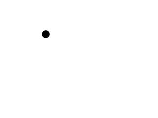
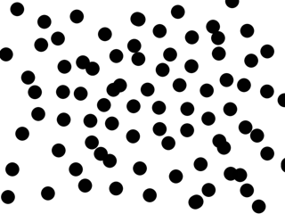
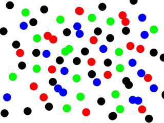
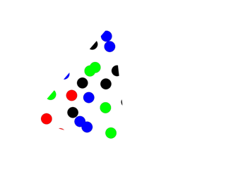
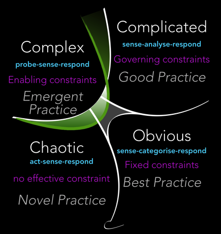
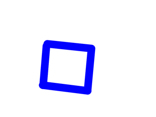
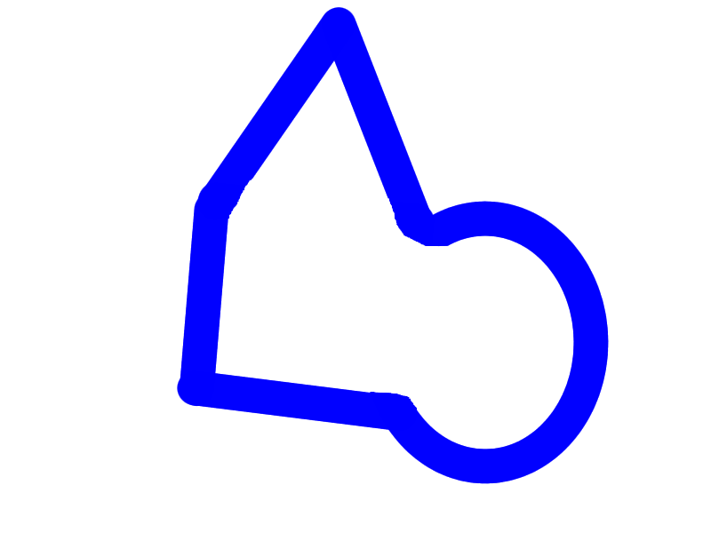
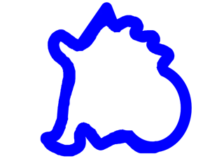
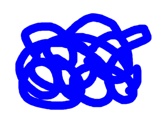

# Complexity

---

"even among scientists, there is no unique definition of complexity – and the scientific notion has traditionally been conveyed using particular examples..."
- Neil johnson ( Physicist & Author of Simply Complexity" )

---

## What makes something complex ?

### How humans deal with it ?

---

## One example with points on a surface (simple 2D)

---

## 1 point

---

## 82 (?) points

---

## 16 R, 17 G, 17 B, 30 N (???)

---

## 20 points (?) in a triangle (?)

---

## More general, talking about Systems
## Cynefin

---

@snap[west]
Unrelated

Events
@snapend

@snap[south]
Mind the gap
@snapend

@snap[east]
Cause
 |
Effects
@snapend

---

## Another example with shapes drawn on a surface (still 2D)

---

# A square

---

## A square with a triangle on the top and circle on the right

---

### Something (???), looks like... a hand ? a country ?

---

#### No idea...

---

## What did we do ? we express what we see in language and :
- we simplify & omit details (I just see a fat blue line !)
- we decompose in smaller / simpler parts (what is a 'square ?)

---

## Simplification

Simplification can be useful or totally useless.

“Everything should be as simple as it can be, but not simpler” - A. Einstein (E = mc2)

---

## Simplification requires a Context

If the context is unknown, it can make things harder to understand / more complex instead.

How about you did not know :

@ul[spaced]
- what a 'point' is ?
- what a '80' is ?
- what a 'G' is ?
@ulend

---

## In that Context, we can then decompose

Example: 
- I saw *points*
- of *4* *colors*

Though this process we identified *abstractions* of a complex 'thing'.

---

## Decomposition needs a way to recompose

This is done with an "algorithm".
- Algorithms can also be very complex in themselves.
- Algorithms need a context in which they can be expressed simply enough

=> Algorithms need to be understood to be reused and be useful.

---

## Complex things needs to be decomposed

This is also done with an "algorithm".
- what we recomposed needs to be compared to original
- what we got should decompose again to the same core 'things'

=> We usually want *determinist* algorithms.

---

# Math

@ul[spaced]
- Science is the process of doubting everything to extract knowledge from the world.
- That knowledge can then be transferred to others so they can use it.
- Math is the toolbox to express that knowledge so that it can be transferred.
@ulend

---

## Math as Mental representation

Math also helps to transfer knowledge from you *now*, to you *tomorrow*.
We do it instinctively all the time.
The trick is just to become aware of it.

---

## Math is everywhere. You already know it.

Do you know :

@ul[spaced]
- what '8' means ? 
- what 'VIII' means ? need context ?
- what '12 - 4' means ?
- what 'sqrt(64)' means ? need context ?
@ulend

---

## 'Advanced' Math Knowledge

Required if we want to survive in a complex world

@ul[spaced]
- what does '1/2 * m * square(v)' means ?
- what does 'CH4 + 2 O2 -> CO2 + 2 H2O' means ?
- what does 'if rain then take umbrella ' ?
- what does '20 % of 10 euros' means ?
- ...
@ulend

---

## Math has a few foundational theories.

- Arithmetic
- Logic
- Group Theory
- Set Theory
- ...

20th century : Foundational crisis in mathematics

---

##  A relatively (1945) recent challenger

Category Theory : 
- simple ( points and arrows )
- powerful ( generates known theories )

---

## Category Theory

Categories represent abstractions of other mathematical concepts. Many areas of mathematics can be formalised by category theory as categories. ( Wikipedia )

It can describe compositionality in a context (a category)
AND it can describe how to compose these contexts to form more complex contexts.

The category of all categories is a category *Cat*

---

## Take the time
Think, experiment, ponder on 'stupid' questions :

@ul[spaced]
- what is 0 ? in roman numerals ?
- what is -2 apple ? why ?
- what is 1/4 of a cake ?
- so if I take 1/0.5 slices, I get double cake ?
- ...
@ulend

---

## Go Forth and Do Science

@ul[spaced]
- why is the sky blue ?
- Ever tried to break a spaghetti in 2 pieces ?
- Can every even integer (> 2) be expressed as the *sum* of two primes ? (Goldbach)
- ...
@ulend

 

